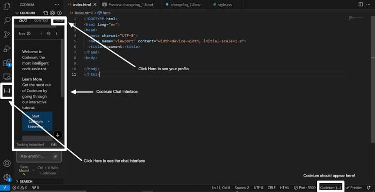

# Интерактивный гид по ИИ-помощнику Codeium в VS Code

Добро пожаловать! Это практическое руководство по установке, настройке и эффективному использованию бесплатного ИИ-ассистента **Codeium** в редакторе Visual Studio Code.

**Целевая аудитория:** Начинающие разработчики и студенты, желающие ускорить написание кода с помощью искусственного интеллекта.

---

## Визуализация инструмента
Ниже представлен интерфейс ИИ-помощника:



---

## Пошаговое руководство (5 базовых шагов)

### Шаг 1. Установка расширения в VS Code
Откройте Visual Studio Code, перейдите во вкладку **Extensions** (Ctrl+Shift+X), введите в поиске `Codeium` и нажмите **Install**.

### Шаг 2. Авторизация в системе
После установки нажмите на иконку Codeium в левом нижнем углу окна и выберите **Log in**. Вас перенаправит на сайт для создания бесплатного аккаунта.

### Шаг 3. Использование автодополнения (Inline Suggestions)
Просто начните писать код. Codeium предложит продолжение строки серым цветом. 
* Чтобы принять подсказку, нажмите клавишу `Tab`.

### Шаг 4. Работа с генерацией кода по комментариям
Вы можете попросить ИИ написать функцию, просто создав комментарий на понятном языке:
```python
# Функция на Python, которая проверяет, является ли число четным
def check_even(number):
    return number % 2 == 0
```

### Шаг 5. Использование встроенного ИИ-чата
Нажмите сочетание клавиш `Ctrl+Shift+I` (или найдите иконку Codeium на боковой панели), чтобы открыть чат. Туда можно отправлять куски кода с вопросами:
```text
Explain this code / Объясни этот код
Refactor this function / Оптимизируй эту функцию
```

---

## Лайфхаки и типичные ошибки

### Типичная ошибка: Конфликт с другими плагинами (например, GitHub Copilot)
Если у вас одновременно включены несколько ИИ-помощников, подсказки начнут накладываться друг на друга, и VS Code начнет зависать.
* **Решение:** Отключите альтернативные плагины в настройках расширений, оставив активным только Codeium.

### Лайфхак: Частичное принятие подсказки
Если Codeium предлагает большой блок кода, но вам нужна только следующая неделя или слово, не обязательно принимать всё:
* Нажмите `Ctrl + Right Arrow` (Стрелка вправо), чтобы принять только **одно следующее слово**.

### Горячие клавиши для запоминания:
* `Tab` — Принять всю подсказку.
* `Alt + [` или `Alt + ]` — Переключить варианты подсказок (если у ИИ есть несколько идей).
